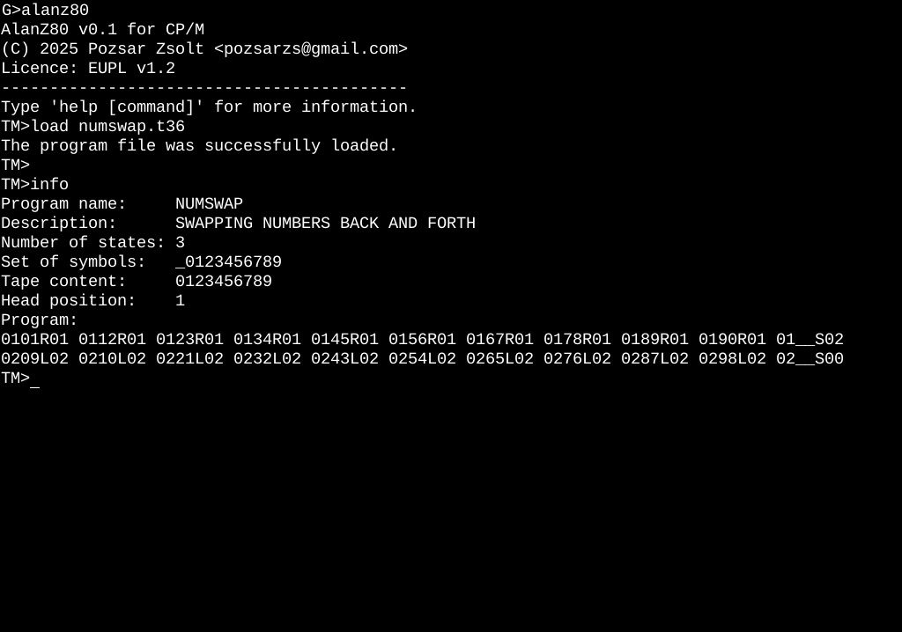

# AlanZ80

**A Turing machine implementation**  

## About Turing machine

A Turing machine is a mathematical model of computation describing an abstract machine that manipulates symbols on a strip of tape according to a table of rules. Despite the model's simplicity, it is capable of implementing any
computer algorithm.

The machine operates on an infinite memory tape divided into discrete cells, each of which can hold a single symbol drawn from a finite set of symbols called the alphabet of the machine. It has a "head" that, at any point in the machine's operation, is positioned over one of these cells, and a "state" selected from a finite set of states. At each step of its operation, the head reads the symbol in its cell. Then, based on the symbol and the machine's own present state, the machine writes a symbol into the same cell, and moves the head one step to the left or the right, or halts the computation. The choice of which replacement symbol to write, which direction to move the head, and whether to halt is based on a finite table that specifies what to do for each combination of the current state and the symbol that is read. As with a real computer program, it is possible for a Turing machine to go into an infinite loop which will never halt.

The Turing machine was invented in 1936 by Alan Turing, who called it an "a-machine" (automatic machine). [^1]

(Source: Wikipedia – Turing machine, CC BY-SA 4.0) [^2]


## About this implementation

Like Turing's original model, this implementation can only work in three ways. What is different is the physical limitations of the implementation, as it cannot be infinite. The number of states and tape symbols is limited, which is still enough to write a sufficiently complex algorithm. The length of the virtual tape is not infinite and the starting position, where processing starts by default, is halfway along the entire length. The starting position can be changed.

The machine expects the program via standard input, which can be entered manually or by redirection. The program has both mandatory and optional sections. In the mandatory section, the number of states, symbols, and algorithm are defined. In the optional section, the initial contents of the tape can be specified; if there is none, the machine prompts for it. In addition, simple commands can be specified that affect the machine's operation during runtime.

Copyright (C) 2025 Pozsár Zsolt <pozsarzs@gmail.com>  


### Features

|features                |                                                     |
|------------------------|-----------------------------------------------------|
|version                 |v0.1                                                 |
|licence                 |EUPL v1.2                                            |
|language                |en                                                   |
|user interface          |CLI                                                  |
|programming language    |Microsoft Fortran-80                                 |
|architecture            |Z80                                                  |
|OS                      |CP/M                                                 |
|symbol set              |up to 40 characters                                  |
|state set               |up to 100 states                                     |
|virtual tape length     |200 cell                                             |
|example program         |4 scripts                                            |
|load from file          |from standard input                                  |


### Screenshots

Startup screen


Help about instructions


### Configuration and operation

#### Program file format

This is an example program that demonstrates inputting data into a Turing machine. Explanations are included in the comments.

```
; It is an example input datafile for AlanZ80

PROG EXAMPLE1
; program description
DESC Swapping numbers back and forth                                           
; symbol set without blank symbol
SYMB 0123456789
; number of the states without q00
STAT 2

; Section program card, this is mandatory
CARD BEGIN
     ; qi SjSkDqm SjSkDqm SjSkDqm SjSkDqm ...
     ST01 01R01 12R01 23R01 34R01 45R01 56R01 67R01 78R01 89R01 90R01 __S02
     ST02 09L02 10L02 21L02 32L02 43L02 54L02 65L02 76L02 87L02 98L02 __S00
     END

; Section tape content, this is optional.
TAPE BEGIN
     ; The asterisk indicates the start position (SPOS):
     ;    *
     DATA 0123456789
     SPOS 1
     END
                                                                                
; Section commands, this is optional.
; These commands affect the program running and can be specified 
; from the command line.
COMM BEGIN
     ; show all operation
     TRACE
     ; It does not ask for input (tape) data, it automatically runs and exits.
     ; If this is not specified and has a tape section, it will give a prompt
     ; and expect input data after running. If there is no tape section, you
     ; will be waiting for an input without running.
     NOPROMPT
     ; run step-by-step
     STEP
     END
END
```

The CONF section specifies the number of states and the symbol set used by the machine. The algorithm in the CODE section will be checked against these.

#### State set

The state is called an m-configuration in Turing terminology. The finite set of states is as follows:

Q = {q00..q99}, where the

- q00 is the mandatory final state,
- q01 is the mandatory start state,
- q02-q99 are optional additional states.

The cardinality of the set is at least two, even if less is specified in the CONF section.

#### Tape symbols

Finite set of tape symbols is as follows:

S = {S00..S39}, where the

- S00 is the mandatory blank (_) character.
- S01-S39 is are optional symbols.

The set has cardinality at least one, and its first element is always the blank
symbol. If the first symbol specified in the CONF section is not blank, then it
will be inserted.

#### Operation

|   |initial state|read|write|move|final state|      5-tuple      |
|:-:|:-----------:|:--:|:---:|:--:|:---------:|:-----------------:|
|N1 |      qi     | Sj | Sk  | L  |    qm     |(qi, Sj, Sk, L, qm)|	
|N2 |      qi     | Sj | Sk  | R  |    qm     |(qi, Sj, Sk, R, qm)|	
|N3 |      qi     | Sj | Sk  |none|    qm     |(qi, Sj, Sk, N, qm)|	

Note:
- D is the head moving direction, D = {R, N, L}.
- qi is the actual state, qi ∈ Q.
- qm is the next state, qm ∈ Q.
- Sj is the actual symbol read from the tape, Sj ∈ S.
- Sk is the symbol to be written to the tape, Sk ∈ S.

In the CODE section of the program, the 5-tuples must be specified in the
following form `01 abL01 __N00`, where the:
- `01` is the initial state (qi),
- `a` and `_` in the groups are read symbols,
- `b` and `_` in the groups are symbols to be written,
- `L` and `N` in the groups are head moving directions,
- `01` and `00` in the groups are final states.

[^1]: Wikipedia – Turing machine, CC BY-SA 4.0
      (https://en.wikipedia.org/wiki/Turing_machine)

[^2]: "On Computable Numbers, with an Application to the Entscheidungsproblem"
      (https://www.cs.virginia.edu/~robins/Turing_Paper_1936.pdf)
